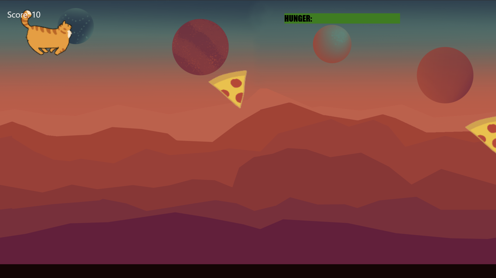
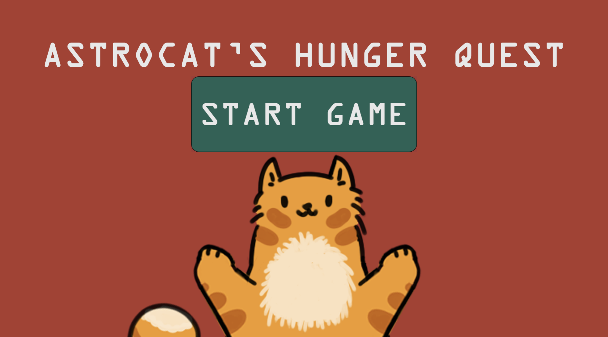

# CCL1
Astrocat's Hunger Quest

A fun and challenging 2D endless jump and run game where you play as a cute cat, 
stranded on a mysterious foreign planet, collecting delicious food while avoiding disguised bombs! 
How long can you survive and how much food can you gather?

## Features
+ Endless Gameplay: Run and jump through an infinite level that needs you to plan your next moves carefully.
+ Adorable Cat Character: Play as a hungry cat on a mission to eat as much food as possible.
+ Deceptive Bombs: Watch out! Some food items are actually disguised bombs.
+ Dynamic Scoring: Earn points for collecting food, but the game ends with a bomb.
+ Easy Controls: controls that make jumping depending on the duration the key is pressed.

## How to Play
* [Click here to play the game!](https://your-github-username.github.io/repository-name)
* Move & Jump: Use w, arrow up key, or spacebar to jump.
* Collect Food: Eat as much food as possible to keep your cat chonky and increase your score.
* Avoid Explosives: Some food is actually a bomb in disguise.
* Survive as Long as Possible: More food will appear over time and it gets more challenging.

## Screenshots

### Main Gameplay:

  
  
*Figure 1: Example of gameplay in action.*

### Menu and UI:

  
  
*Figure 2: Menu and user interface.*

### Spritesheets
Below are the sprites used to create the character:

### Player Character:

  
  
*Figure 3: Player character animations.*

## Technologies Used
Programming Language: HTML, JavaScript, CSS
Art & Design: Photoshop

## Reflection

### What went well:
**Design:** The game looked similar to what I have imagined and it was really fun to design the cat character and the spritesheets.
**Core Mechanics:** The delayed jumping was not planned but made the game more interesting.

### Challenges:
**Thinking like a computer:** Thinking how I could program something to get to the working code was really hard.
**Time:** Dividing tasks to finish on time and implementing the different features within the time frame was not that easy troughout both weeks.

### Achievements:
**Understanding:** Thinking how to program something is now easier, because I had to learn it in a short time to progress with my game. I also gained a better understanding of my code.
